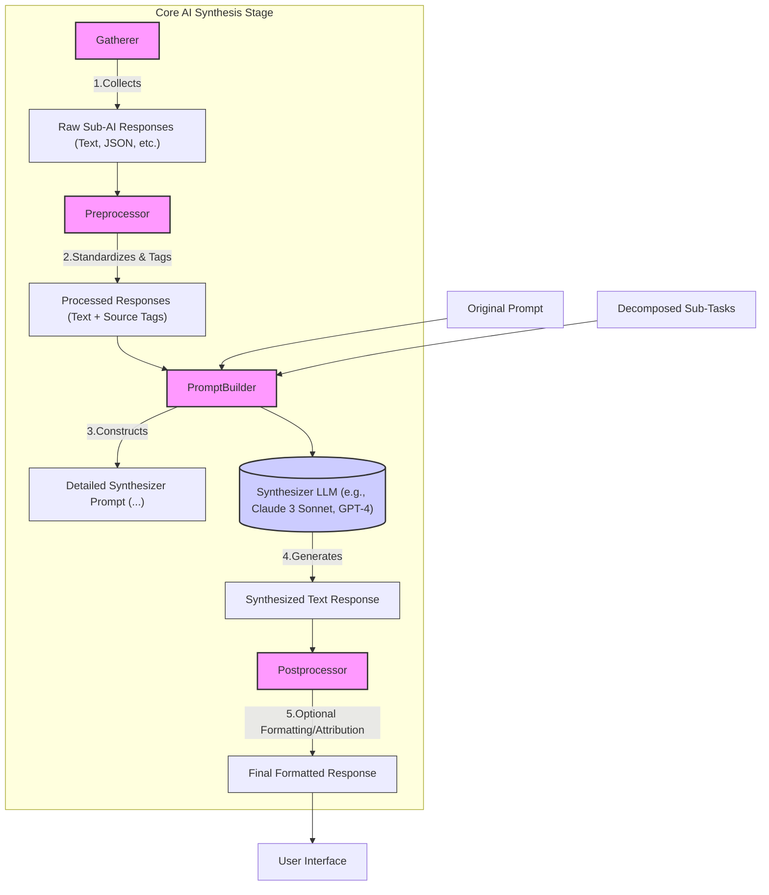
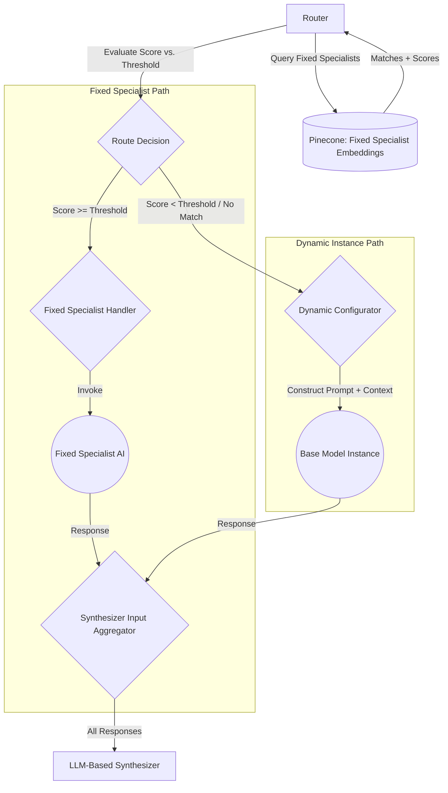
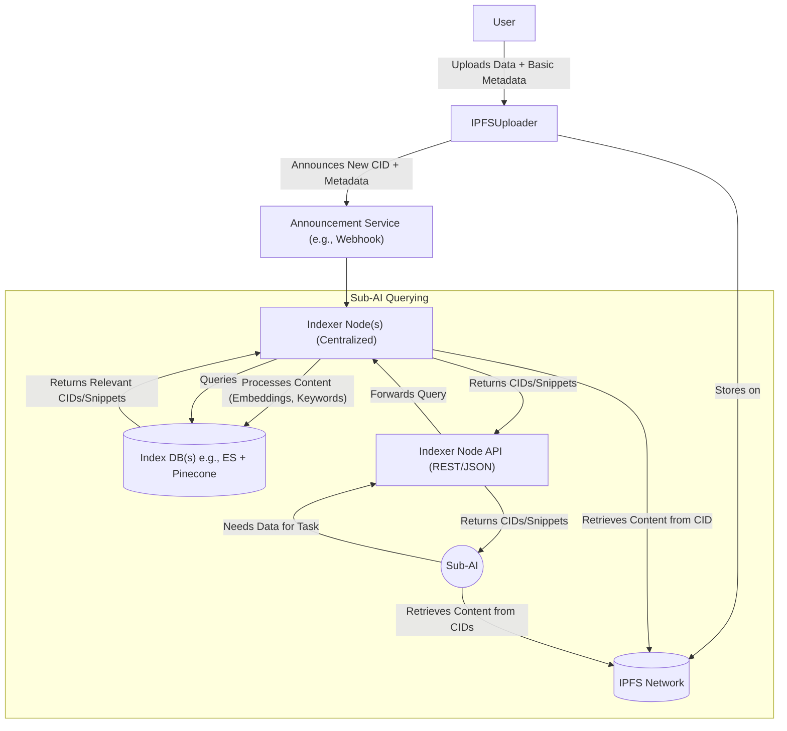
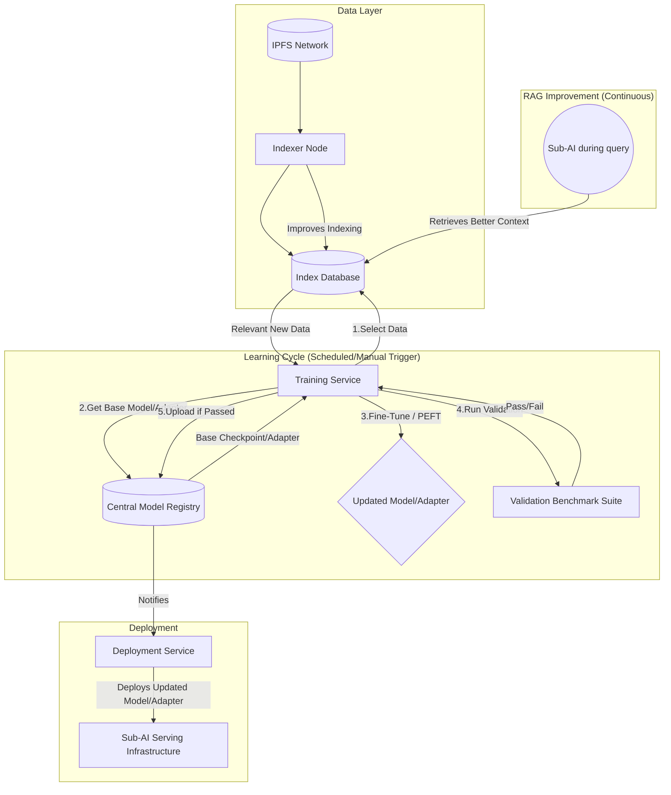
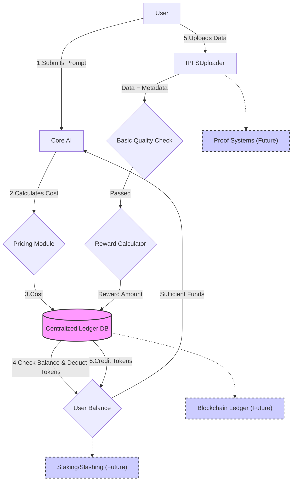
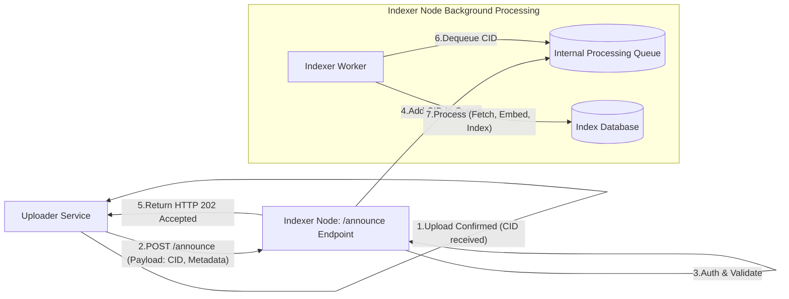

# Co-Lab: Core AI Prompt Processing Pipeline Architecture

This readme outlines the architectural decisions for the initial implementation of the Co-Lab Core AI's prompt processing pipeline and related systems, covering decomposition, routing, synthesis, the nature of Sub-AIs, IPFS data discovery, continuous learning, initial tokenomics, API design strategy, and the announcement service.

## Overall Goal

To take a user's natural language prompt, break it down into manageable sub-tasks, route those tasks to appropriate specialized Sub-AIs, leverage IPFS for up-to-date information, synthesize the results into a coherent, complete, and conflict-resolved final answer, continuously improve the system based on new data, and create a sustainable ecosystem via token incentives.

## 1. Decomposition & Routing

This stage transforms the user prompt into specific tasks for Sub-AIs.

**Technology Stack (Initial Phase - Prioritizing Development Speed):**

*   **Decomposer:** API-based LLM (e.g., Claude 3 Haiku, GPT-3.5-Turbo)
    *   **Function:** Receives the user prompt and uses prompt engineering (including JSON mode enforcement) to break it down into a structured list of sub-tasks (e.g., `[{sub_task_id: "...", instruction: "..."}]`).
*   **Embedding Model:** API-based Model (e.g., OpenAI `text-embedding-3-small`)
    *   **Function:** Converts the textual `instruction` of each sub-task and the descriptive text of each Sub-AI into dense vector embeddings.
*   **Vector Database:** Managed Cloud Service (Pinecone Serverless)
    *   **Function:** Stores the vector embeddings of all available *fixed specialist* Sub-AIs along with their metadata. Performs efficient semantic similarity searches to find the best matching Sub-AI(s) for each sub-task embedding.

**Workflow:**

1.  User prompt received by Core AI.
2.  Prompt sent to Decomposer LLM API.
3.  Structured list of sub-tasks returned.
4.  For each sub-task `instruction`, generate an embedding using the Embedding API.
5.  Query Pinecone using the sub-task embedding to find the most semantically similar *fixed specialist* Sub-AI embedding(s), potentially filtering by metadata (e.g., `status='active'`).
6.  Evaluate the similarity score against a confidence threshold to decide whether to route to a fixed specialist or trigger the dynamic instance fallback (see Section 4).
7.  Dispatch the sub-task `instruction` to the identified fixed specialist or the dynamically configured instance.

## 2. Sub-AI Description Management

Effective semantic routing relies on high-quality representations of Sub-AI capabilities stored in the vector database. This primarily applies to the *fixed specialist* Sub-AIs in the Hybrid model.

*   **Description Content:** Each fixed specialist Sub-AI requires a clear, natural language description covering its purpose, key capabilities/tasks, domain keywords, and optionally inputs/outputs/limitations.
*   **Metadata:** Stored alongside the vector embedding in Pinecone for each fixed specialist Sub-AI:
    *   `sub_ai_id` (string, unique identifier)
    *   `name` (string, human-readable)
    *   `description_text` (string, used for embedding)
    *   `status` (string: 'active', 'inactive', etc.)
    *   `version` (string)
    *   `tags` (list of strings, for keyword filtering)
    *   `creation_timestamp` (integer/datetime)
*   **Management:**
    *   Maintain a central registry (e.g., config file, DB table) as the source of truth for fixed specialist descriptions and metadata.
    *   An update process re-embeds the `description_text` and upserts the vector and metadata into Pinecone when changes occur. Metadata-only changes (like status) can be updated directly in Pinecone.

## 3. Synthesis Mechanism

This stage combines the results from Sub-AIs (both fixed and dynamic) into the final user response.

**Approach: LLM-Based Synthesizer**

*   **Rationale:** Leverages a powerful LLM to handle complexity, ensure coherence, and perform conflict resolution, aligning with priorities (Coherence/Completeness > Conflict Resolution > Attribution).
*   **Synthesizer LLM:** API-based Model (e.g., Claude 3 Sonnet, GPT-4).
*   **Workflow:**
    1.  **Gather Responses:** Collect all outputs from invoked Sub-AIs.
    2.  **Pre-process:** Standardize diverse formats (e.g., convert JSON to descriptive text) and tag each piece of information with its source Sub-AI ID (or indicate if it came from a dynamic instance) and corresponding sub-task ID.
    3.  **Construct Prompt:** Build a detailed prompt for the Synthesizer LLM containing:
        *   The original user prompt.
        *   The list of decomposed sub-tasks.
        *   The pre-processed and tagged Sub-AI responses.
        *   Explicit synthesis instructions emphasizing coherence, completeness, conflict resolution, and logical structure.
    4.  **Invoke LLM:** Send the prompt to the Synthesizer LLM API.
    5.  **Receive Synthesized Text:** Get the final combined response.
    6.  **Post-process (Optional):** Apply final formatting for UI display; potentially add a separate attribution layer if needed in the future.

**Diagram (Mermaid Code):**

## 4. Sub-AI Nature & Implementation

This section defines the types of Sub-AIs used within the Co-Lab system.

**Approach: Hybrid Model (Fixed Specialists + Dynamic Instances)**

*   **Rationale:** Balances the reliability and performance of specialized models with the flexibility to handle novel or less common tasks, aligning with Co-Lab's goal of adaptability.
*   **Components:**
    *   **Fixed Specialist Sub-AIs:** A curated set of pre-defined, optimized Sub-AIs for common domains/tasks. These are registered in Pinecone with detailed descriptions and metadata. See Section 4.1 for the initial set.
    *   **Dynamic Instance Capability:** A fallback mechanism using one or more flexible "Base Models" (e.g., general instruction-following models like Phi-3, Llama 3, or API models like Claude 3 Haiku/Sonnet).
*   **Workflow Integration:**
    1.  **Routing Decision:** After semantic search against fixed specialists in Pinecone (Step 5 in Section 1), the Core AI evaluates the match score.
    2.  **Route to Fixed:** If a fixed specialist matches above a confidence threshold, the task is routed to it.
    3.  **Route to Dynamic:** If no good match is found, the Core AI (or a "Dynamic Configurator" module) constructs a specific prompt for a Base Model, including the sub-task instruction and relevant context, effectively creating a temporary, dynamically configured expert.
    4.  **Invocation:** The Core AI invokes either the fixed specialist or the dynamically configured base model.
    5.  **Synthesis:** Responses from both types are handled uniformly by the Synthesizer (Section 3).

**Diagram (Mermaid Code):**

*   **Implementation Considerations:** Requires defining the initial set of fixed specialists, tuning the routing threshold, selecting base model(s) for dynamic instances, and designing the dynamic prompting/context injection mechanism (related to Section 5).

### 4.1 Initial Fixed Specialist Set (V1)

This list represents the target set of fixed specialists for the initial version of Co-Lab. Each requires a detailed description and metadata entry in the registry (Section 2).

*   **`IPFSSearchAndRetrieveAI`**
    *   **Function:** Specialized in interacting with the Indexer Nodes (Section 5). Takes natural language queries or keywords, translates them into effective queries for the indexer (keyword and semantic), retrieves relevant CIDs and metadata, and potentially fetches/pre-processes content snippets from IPFS. Foundational component.
*   **`SummarizationAI`**
    *   **Function:** Takes CIDs pointing to text documents on IPFS (or raw text) and generates concise summaries. May support parameters for length/style.
*   **`CodeGeneratorAI`**
    *   **Function:** Generates code snippets or simple programs based on natural language descriptions. May leverage `IPFSSearchAndRetrieveAI` to find relevant code examples on IPFS.
*   **`QuestionAnsweringAI`**
    *   **Function:** Answers specific questions based on the content of provided IPFS documents (CIDs) or text context. Likely uses RAG internally.
*   **`DataAnalysisAI` (Optional V1)**
    *   **Function:** Performs basic analysis on structured data (e.g., CSV, JSON) found at a given CID on IPFS (e.g., calculate statistics, identify trends). Implementation may be deferred to simplify MVP.

## 5. IPFS Data Discovery & Indexing

This section outlines how Sub-AIs find relevant information stored on IPFS.

**Strategy: Centralized Indexing (Initial) with Path to Decentralization**

*   **Rationale:** Provides necessary performance and query flexibility (keyword, semantic) for the initial implementation while acknowledging the long-term goal of decentralization.
*   **Initial Implementation Components:**
    *   **Announcement Service:** A mechanism (e.g., HTTP Webhook - see Section 9) for users/processes uploading to IPFS to announce new CIDs and associated basic metadata.
    *   **Indexer Node(s):** Centralized service(s) that subscribe to announcements or receive webhook calls, retrieve content from IPFS using the CID, process the content (extract text, generate embeddings using the system's Embedding Model, index keywords), and store the results.
    *   **Index Database(s):** Centralized databases managed by the Indexer Nodes (e.g., Elasticsearch for keyword search, Pinecone/Weaviate for semantic vector search). Stores processed data, embeddings, metadata, and the source CID.
*   **Query Workflow:**
    1.  A Sub-AI (fixed or dynamic) determines it needs external information for its task.
    2.  It formulates a query (keywords, natural language for semantic search, metadata filters) and sends it to the Indexer Node API (REST/JSON).
    3.  The Indexer Node queries its internal database(s).
    4.  The Indexer Node returns a list of relevant CIDs (and potentially snippets or metadata).
    5.  The Sub-AI retrieves the full content for the required CIDs directly from the IPFS network (using an IPFS client).
*   **Context for Dynamic Sub-AIs:** The results from the Indexer (relevant CIDs or processed snippets) can be passed as context when configuring a dynamic Sub-AI instance.
*   **Long-Term Vision:** Plan a migration path towards a more decentralized indexing solution (e.g., federated indexers, incentivized network using Tokenomics, integration with OrbitDB/Ceramic, Libp2p PubSub for announcements).

**Diagram (Mermaid Code):**

## 6. Continuous Learning/Updating Mechanism

This section describes how the system incorporates new knowledge from IPFS over time.

**Strategy: Scheduled/Manual Fine-Tuning (Initial) & RAG Improvement**

*   **Rationale:** Provides a structured way to update models based on new data, starting with manageable centralized processes.
*   **Initial Implementation Components:**
    *   **Trigger:** Scheduled intervals (e.g., weekly) and manual triggers initiate update cycles.
    *   **Data Selection:** A process queries the Index Database (Section 5) to find recently indexed, relevant documents (based on metadata/semantic search) for specific Fixed Specialist domains.
    *   **Update Method (Fixed Specialists):** Use Fine-tuning or Parameter-Efficient Fine-Tuning (PEFT, e.g., LoRA) on the selected new data to update the specialist models or create adapters.
    *   **Update Method (Dynamic Instances):** Focus on improving the Retrieval-Augmented Generation (RAG) context provided during dynamic configuration by enhancing the Indexer's retrieval capabilities (better indexing, query understanding). Base models may be updated less frequently via fine-tuning.
    *   **Validation:** Updated models/adapters are evaluated against domain-specific benchmark datasets before deployment.
    *   **Distribution:** Updated models/adapters stored in a Centralized Model Registry and deployed via standard MLOps practices.
*   **Long-Term Vision:** Evolve towards more automated triggers (data volume, performance monitoring), decentralized training/validation (potentially incentivized via Tokenomics), and decentralized model distribution (e.g., via IPFS/torrents).

**Diagram (Mermaid Code - Initial Centralized Flow):**

## 7. Initial Tokenomics Plan

This section outlines the initial approach to the Co-Lab token system for incentivizing participation and managing resource usage.

**Strategy: Centralized Ledger (MVP) with Path to Decentralization**

*   **Rationale:** Allows for rapid implementation and testing of the core economic loop without the immediate complexity of blockchain integration. Provides a foundation for future decentralization.
*   **Token:** `COLAB` (Placeholder Name) - Native utility token.
*   **Ledger:** **Centralized Database** managed by the core Co-Lab entity tracks balances and transactions.
*   **Initial Utility:**
    *   **Spending:** Users spend `COLAB` to submit queries based on the V1 pricing model (see Section 7.1).
    *   **Earning:** Users earn `COLAB` for **Data Contribution** based on the V1 rewards model (see Section 7.2).
*   **Initial Distribution:** A plan is required to allocate the initial supply (see Section 7.3).
*   **Deferred Features:** Complex mechanisms like staking, slashing, reputation systems, cryptographic proofs of compute/storage, and on-chain governance are deferred to later phases.
*   **Long-Term Vision:** Plan a migration path to a **Blockchain-based Ledger** (e.g., L2, AppChain) and implement sophisticated incentive and quality control mechanisms.

**Diagram (Mermaid Code - Initial Centralized Flow):**

### 7.1 Query Pricing Model (V1)

This model calculates the cost for a user submitting a prompt in the initial phase.

*   **Formula:**
    `TotalCost = BaseFee + DecompositionCost + RoutingCost + InvocationCost + SynthesisCost`
*   **Components:**
    *   **`BaseFee`:** Small fixed fee per prompt (e.g., 1 `COLAB`).
    *   **`DecompositionCost`:** Fixed cost for the Decomposer LLM call (e.g., 5 `COLAB`).
    *   **`RoutingCost`:** Cost per sub-task for embedding/vector search (`NumSubTasks * CostPerSubTaskRouting`, e.g., 0.5 `COLAB` per task).
    *   **`InvocationCost`:** Sum of costs for each invoked Sub-AI, based on tiered fixed costs:
        *   Simple Fixed Specialist (e.g., Summarization): Low cost (e.g., 2 `COLAB`).
        *   Complex Fixed Specialist (e.g., CodeGenerator): Medium cost (e.g., 5 `COLAB`).
        *   Dynamic Instance: High cost (e.g., 10 `COLAB`).
    *   **`SynthesisCost`:** Fixed cost for the Synthesizer LLM call (e.g., 10 `COLAB`).
*   **Notes:** Example values require tuning based on actual API costs and resource usage. Future versions may incorporate LLM token counts.

### 7.2 Data Contribution Rewards & Quality Checks (V1)

This model defines how users earn tokens for uploads and the basic checks performed.

*   **Reward Calculation:**
    `Reward = (FileSizeInMB * RewardPerMB) + MetadataBonus`
    *   **`RewardPerMB`:** Base rate per megabyte (e.g., 0.01 `COLAB`). Needs tuning.
    *   **`MetadataBonus`:** Fixed bonus if required metadata fields (`filename`, `description`, `tags`) are present and non-empty (e.g., 0.5 `COLAB`).
*   **Quality Checks (Performed by Uploader Service before reward):**
    1.  **File Size Limits:** Check if `0 < FileSize <= MaxAllowedSize` (e.g., 1 GB). Reject if outside limits.
    2.  **Duplicate Content Check:** Check if the `CID` was recently rewarded (requires storing `RewardedCIDs(cid, timestamp)`). Reject reward if duplicate.
    3.  **Basic Metadata Validation:** Check if required fields are present and non-empty. Withhold `MetadataBonus` if validation fails.
*   **Workflow:** Uploader service performs checks after IPFS upload, calculates reward, calls Ledger API to credit user, then calls Announcement Service.

### 7.3 Initial Token Distribution (Placeholder)

*   A detailed plan is needed to allocate the initial supply of `COLAB` tokens. This plan must define the total supply and the allocation percentages/amounts for key categories. Vesting schedules and lock-up periods are crucial for certain allocations.
*   **Categories to Consider:**
    *   Team & Advisors (Vesting Required)
    *   Early Contributors / Investors (Vesting/Lock-ups likely)
    *   Foundation / Treasury (For ongoing development, grants, ecosystem growth)
    *   Ecosystem Incentives / Rewards (For future data, compute, storage, staking rewards)
    *   Community / Public Allocation (Airdrops, Public Sale, Grants)
    *   Liquidity Provision (For DEXs, if applicable)
*   *(Specific percentages, total supply, and schedules TBD)*

## 8. API Design Strategy

This section outlines the strategy for communication between different Co-Lab components.

*   **Primary Protocol:** **RESTful APIs** over HTTP/1.1 or HTTP/2 for simplicity, compatibility, and alignment with FastAPI.
*   **Data Format:** **JSON** for all API request and response bodies, leveraging Pydantic for schema definition and validation.
*   **Authentication (Internal):** Initial phase uses **API Keys** shared between services (managed via configuration). Future phases may adopt JWT, OAuth2, or mTLS.
*   **API Versioning:** Use **URL Path Versioning** (e.g., `/api/v1/...`).
*   **Error Handling:** Use standard HTTP status codes (4xx/5xx) and consistent JSON error bodies (e.g., `{"detail": "error message", "error_code": "optional_code"}`).
*   **Specific Interactions (Initial):**
    *   UI <-> Core AI Gateway: REST/JSON
    *   Core AI <-> Indexer API: REST/JSON
    *   Core AI <-> Sub-AI API: REST/JSON
    *   Core AI <-> Ledger API: REST/JSON
    *   IPFS Uploader -> Announcement Service: Asynchronous (Webhook initially - see Section 9).
*   **Future Optimizations:** Consider gRPC for performance-critical internal links; consider GraphQL for complex data fetching needs.

## 9. Announcement Service (V1)

This section describes how Indexer Nodes are notified about new content added to IPFS.

**Approach: Simple HTTP Webhook**

*   **Rationale:** Straightforward to implement for the initial centralized phase.
*   **Workflow:**
    1.  An "Uploader Service" confirms data is pinned to IPFS and receives the CID.
    2.  The Uploader Service constructs a JSON payload containing the `cid` and any user-provided `metadata`.
    3.  The Uploader Service sends an HTTP POST request (with API Key auth) to a configured Indexer Node endpoint (e.g., `/announce`).
    4.  The Indexer Node endpoint authenticates, validates the payload, and adds the CID/metadata to an internal processing queue (e.g., in-memory, Redis, Celery) for background indexing.
    5.  The Indexer Node returns an immediate success response (e.g., HTTP 202 Accepted) to the Uploader.
*   **Considerations (V1):** Assumes a single or known set of Indexer Node endpoints configured in the Uploader. Basic retry logic in the Uploader for transient errors. More robust queuing and potential use of Pub/Sub systems (Redis, Kafka, Libp2p) can be explored later.

**Diagram (Mermaid Code):**

## 10. Next Steps

The high-level architectural plan covering the core pipeline, Sub-AI structure, data handling, learning, tokenomics, APIs, and announcements is now defined. The next phase involves detailed design and implementation based on this blueprint. Key immediate tasks include:
*   Detailed implementation of the API endpoints and internal logic for each component (Core AI, Indexer, Sub-AIs, Ledger, Uploader).
*   Setting up the required infrastructure (databases, vector DB, potentially Sub-AI serving).
*   Refining placeholder values (e.g., token costs/rewards, routing thresholds).
*   Developing the specific implementation for the initial Fixed Specialist Sub-AIs.
*   Creating a detailed plan for the Initial Token Distribution.
